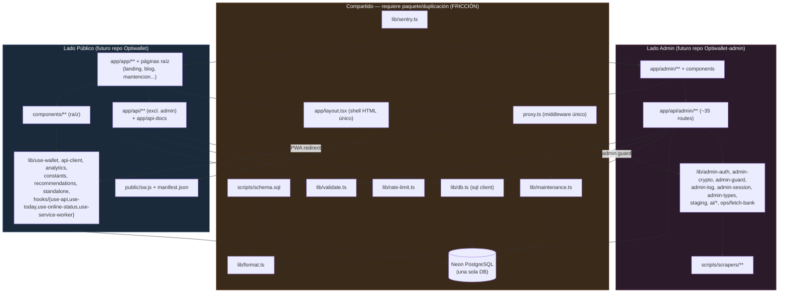

# OptiWallet — Monorepo Split Map

Análisis de solo lectura para dividir el repo actual en `Optiwallet` (app pública/PWA end-user)
y `Optiwallet-admin` (panel de administración). Generado el 2026-07-01.

> Nota importante: este NO es un monorepo con workspaces (`npm workspaces`, `turbo`, `nx`, etc.).
> Es una única app Next.js 16 (App Router) donde admin y público conviven en los mismos
> directorios top-level (`app/`, `lib/`, `components/`, `scripts/`). "Módulos" aquí son
> agrupaciones lógicas descubiertas por análisis de imports, no paquetes declarados.

## 1. Módulos top-level identificados

| Módulo | Alcance | Lado |
|---|---|---|
| `app/admin/**` | Páginas y layout del panel admin | Admin |
| `app/api/admin/**` | ~35 route handlers admin | Admin |
| `app/app/**` + páginas raíz (`app/page.tsx`, `blog`, `contacto`, `cookies`, `prensa`, `privacidad`, `roadmap`, `sobre-nosotros`, `terminos`, `mantencion`, `not-found`, `error`, `global-error`) | PWA end-user + marketing | Público |
| `app/api/**` (excl. admin) + `app/api-docs/**` | 12 endpoints públicos + Swagger UI | Público |
| `lib/**` (raíz + `ai/`, `hooks/`, `ops/`) | Librerías compartidas/admin/públicas | Mixto (ver tabla §3) |
| `components/**` (raíz) + `app/admin/components/**` | UI | Separado limpiamente por carpeta |
| `scripts/**` + `tests/**` | Infra de DB, seeding, scraping, admin bootstrap, tests | Mixto |
| Config raíz: `proxy.ts`, `next.config.mjs`, `package.json`, `tsconfig.json`, `vercel.json`, `sentry.*.config.ts`, `.env.example`, `public/manifest.json`, `public/sw.js` | Infra compartida | Mixto |
| `docs/**` | Documentación | Mixto (ver §5) |

## 2. Grafo de dependencias (Mermaid)

## 3. Clasificación de `lib/**` (el núcleo de la decisión)

| Archivo | Clasificación | Motivo |
|---|---|---|
| `lib/db.ts` | **COMPARTIDO** | Cliente `sql` lazy-singleton usado por ~35 rutas admin y ~15 públicas |
| `lib/validate.ts` | **COMPARTIDO** | Validadores puros usados por CRUD admin y por query params públicos |
| `lib/format.ts` | **COMPARTIDO** | `toISODateLocal` usado por páginas públicas y por `reports/triage` (admin) |
| `lib/rate-limit.ts` | **COMPARTIDO** | Limiter in-memory documentado explícitamente como compartido (admin login + endpoints públicos) |
| `lib/maintenance.ts` | **COMPARTIDO** | Escrito por admin, leído por `proxy.ts` que gatea todo el tráfico público |
| `lib/sentry.ts` | **COMPARTIDO** | Una sola inicialización Sentry; filtra `/admin` en runtime en vez de no cargar |
| `lib/standalone.ts` | Compartido solo por *wiring* actual | Lógica 100% pública (PWA); solo "compartido" porque el root layout único monta sus componentes en todas las rutas |
| `lib/admin-auth.ts`, `admin-crypto.ts`, `admin-guard.ts`, `admin-log.ts`, `admin-session.ts`, `admin-types.ts` | Admin-only | Solo consumidos por `app/api/admin/**`; `admin-session.ts` también por `proxy.ts` |
| `lib/staging.ts`, `lib/ops/fetch-bank.ts` | Admin-only | Pipeline de scraping/staging, solo rutas de ops |
| `lib/ai/provider.ts`, `ai/merchant-suggest.ts`, `ai/report-triage.ts` | Admin-only | Solo usado por `app/api/admin/ops/**` |
| `lib/hooks/use-modal-keyboard.ts` | Admin-only hoy | Solo usado por modales de `app/admin/components` (genérico pero sin otros consumidores) |
| `lib/analytics.ts`, `lib/api-client.ts`, `lib/constants.ts`, `lib/recommendations.ts`, `lib/use-wallet.ts`, `lib/openapi.ts` | Público-only | Sin ningún consumidor admin confirmado |
| `lib/hooks/{use-api,use-today,use-online-status,use-service-worker}.ts` | Público-only | Solo consumidos por páginas `/app` y componentes públicos |

## 4. Puntos de corte candidatos (bajo esfuerzo, límites ya limpios)

Estos se pueden cortar con copy-paste directo, sin refactor de lógica:

1. **`app/admin/**` + `app/api/admin/**`** → mover completo a `Optiwallet-admin`. No hay imports cruzados hacia `components/` raíz ni hacia `app/app/**`.
2. **`app/admin/components/**`** (7 componentes) → van con el módulo anterior, cero uso fuera de admin.
3. **`components/**` raíz** (20 componentes) → quedan en `Optiwallet`, cero uso desde admin.
4. **`lib/admin-*.ts` (6 archivos) + `lib/staging.ts` + `lib/ops/fetch-bank.ts` + `lib/ai/**`** → mover completo a admin. Única excepción: `admin-session.ts` también lo usa `proxy.ts` (ver fricción).
5. **`lib/{analytics,api-client,constants,recommendations,use-wallet,openapi}.ts` + `lib/hooks/{use-api,use-today,use-online-status,use-service-worker}.ts`** → quedan en público, sin consumidores admin.
6. **`public/sw.js` + `public/manifest.json`** → 100% público. El código que excluye `/admin` del cache se vuelve código muerto y se puede borrar limpiamente en el split.
7. **`docs/ADMIN.md` y `docs/SCRAPING.md`** → mover íntegros a admin. **`docs/API.md`** → íntegro a público.
8. **Tests**: `admin-crypto.test.ts` → admin; `analytics.test.ts`, `api-client.test.ts`, `recommendations.test.ts`, `standalone.test.ts` → público.
9. **Scripts de bootstrap admin**: `create-admin.ts`, `encrypt-totp.ts`, `test-login-flow.ts` → admin. **Scripts de datos públicos**: `seed.ts`, `gen-seed.ts`, `migrate-categories-to-tags.ts`, `compute-merchant-popularity.ts`, `refresh-promos.ts` → público (o quedan donde viva la DB canónica, ver fricción #5).
10. **`scripts/scrapers/**`** → van con admin (alimentan `/admin/ops/import`).
11. **`vercel.json`, `tsconfig.json`** → duplicables trivialmente; ambos son genéricos (`@/*` → `./*`, `regions: ["gru1"]"`), sin nada monorepo-específico que reescribir.

## 5. Puntos de fricción (requieren decisión de arquitectura antes de cortar)

### 5.1 Base de datos única (`lib/db.ts`, `scripts/schema.sql`) — **el mayor bloqueante**
Ambos lados leen/escriben la misma Neon DB con el mismo `sql` client. `schema.sql` mezcla tablas
admin-only (`admin_users`, `admin_login_attempts`, `admin_audit_log`, `scraper_runs`,
`promo_staging`, `scraper_raw_cache`), públicas (`banks`, `cards`, `merchants`, `promotions`,
`promo_events`, `promo_reports`, etc.) y una tabla verdaderamente compartida: **`app_settings`**
(maintenance mode — escrita por admin, leída por el middleware público).

**Decisión requerida**: ¿se mantiene una sola DB compartida entre los dos repos (cada uno con su
propio `DATABASE_URL` apuntando al mismo Neon), o se separan las bases de datos? Separar DBs
rompe `app_settings` (maintenance mode) y requeriría un mecanismo alternativo (ej. un endpoint
público que el admin consulte, o un flag distinto). Mantener una DB compartida implica que
`schema.sql` y los scripts `db:*` deben vivir en algún lugar accesible por ambos repos —
duplicado (con riesgo de drift) o extraído a un tercer repo/paquete de infraestructura.

### 5.2 `proxy.ts` — un solo archivo de middleware con tres responsabilidades
Hoy mezcla en una función: (a) maintenance-mode redirect (público, exento admin), (b) guard de
sesión admin (`getAdminFromRequest` de `lib/admin-session.ts`), (c) redirect PWA standalone
(público). Al separar repos esto se vuelve DOS archivos de middleware distintos, cada uno con su
propio matcher — trivial de escribir, pero el punto de fricción real es que **el maintenance
mode debe seguir siendo controlable desde el admin y respetado por el público**, lo cual vuelve
a depender de §5.1 (DB compartida o un mecanismo cross-repo).

### 5.3 Root layout único (`app/layout.tsx`) sirve ambos lados
`app/admin/layout.tsx` no define su propio `<html>/<body>` — hereda del layout raíz, que además
monta `ServiceWorkerRegistrar`, `StandaloneCookieSync` y `OfflineBanner` (conceptualmente 100%
públicos/PWA) y las fuentes de Google. Estos componentes están "neutralizados" en rutas
`/admin` mediante checks de string (`pathname.startsWith("/admin")`) dentro de
`lib/analytics.ts` y `lib/sentry.ts`, no por no-renderizado condicional.

**Al separar**: `Optiwallet-admin` necesita su propio root layout completo (`<html>/<body>`,
fuentes, `admin.css`) sin los tres componentes PWA. Los checks `/admin` en `analytics.ts` y
`sentry.ts` se vuelven código muerto que hay que limpiar en cada copia.

### 5.4 Design tokens compartidos vía CSS custom properties
`app/admin/admin.css` (989 líneas) no importa `globals.css`/`landing.css` directamente, pero
reutiliza variables (`--bg`, `--ink`, `--lime`, `--font-serif`, etc.) definidas ahí. Al separar,
hay que decidir: ¿se copia el set de tokens dentro de `Optiwallet-admin` (duplicación con riesgo
de drift visual) o se extrae un mini paquete de design tokens compartido? Bajo riesgo técnico,
pero requiere decisión de producto/diseño sobre si el admin debe mantener el mismo lenguaje
visual del público a futuro.

### 5.5 `lib/validate.ts`, `lib/format.ts`, `lib/rate-limit.ts` — utilidades puras usadas por ambos
Sin efectos secundarios ni dependencias externas, así que técnicamente la fricción es baja: se
pueden **duplicar sin riesgo real de drift** (son funciones pequeñas y estables) o extraerse a un
paquete npm privado compartido (`@optiwallet/shared`). Recomendación: duplicar primero, extraer
paquete solo si empiezan a divergir.

### 5.6 `app/admin/page.tsx` llama a `/api/stats` (endpoint público)
El dashboard admin hace `fetch("/api/stats")`, una ruta pública, no admin. Al separar en dos
despliegues distintos, esa URL debe apuntar al dominio del repo público (variable de entorno
para base URL) o el endpoint debe re-implementarse/proxyearse en el lado admin.

### 5.7 `lib/rate-limit.ts` — limiter in-memory, no distribuido
Ya es una limitación hoy (se resetea en cada cold start, no usa Redis/Upstash), pero al separar
en dos deploys de Vercel independientes, cada uno tendrá su propio estado in-memory — esto ya es
cierto hoy entre instancias/regiones, así que el split no empeora nada, pero vale la pena
mencionarlo si se decide centralizar rate limiting en el futuro.

### 5.8 Documentación que interlaza ambos lados
`docs/ARCHITECTURE.md` y `docs/SECURITY.md` mezclan contenido admin y público en las mismas
secciones (p. ej. SECURITY.md tiene una sección "Panel de administración" pero también
menciona cookies/CSP que aplican a ambos). Requieren reescritura manual, no un simple `mv`.

### 5.9 Scripts de datos (`popularity:compute`, `promotions:refresh`) — ¿dueño admin u ops compartido?
Alimentan datos que se ven reflejados en el ranking público (`popularity_prior`) pero se
gestionan como jobs de cron/ops, conceptualmente cerca del admin panel. Hay que decidir dónde
viven — probablemente junto a la DB compartida (§5.1), no necesariamente en ninguno de los dos
repos de aplicación.

## 6. Recomendación de orden de ejecución

1. Resolver §5.1 primero (estrategia de DB) — todo lo demás depende de esta decisión.
2. Extraer `lib/validate.ts`, `lib/format.ts`, `lib/rate-limit.ts` como duplicados simples (bajo riesgo).
3. Escribir dos `proxy.ts` independientes y dos root layouts independientes.
4. Mover directorios "limpios" del §4 (son > 80% del código, sin fricción).
5. Reescribir manualmente `ARCHITECTURE.md` y `SECURITY.md` partiéndolos en dos.
6. Decidir destino de scripts de datos/scraping y del `schema.sql` canónico.
