# Fase 1: Mapa de Dependencias para la Separación de OptiWallet

## Contexto

El monorepo actual contiene dos productos acoplados dentro de una sola app Next.js:
1. **User App** — PWA pública (`/app`, `/landing`, `/blog`, APIs de lectura)
2. **Admin Panel** — Dashboard privado (`/admin`, APIs de escritura CRUD + ops)

Ambos comparten la misma base de datos Neon, el mismo `proxy.ts`, el mismo `layout.tsx` raíz y un subconjunto de módulos en `lib/`.

---

## 1. Inventario Completo de Archivos

### 1.1 Rutas `app/` — User App (permanecen en el repo original)

| Ruta | Tipo | Descripción |
|------|------|-------------|
| `app/layout.tsx` | Root Layout | Layout global (fonts, SW, Plausible) |
| `app/page.tsx` | Landing | Página de aterrizaje |
| `app/globals.css` | Estilos | CSS global de la app |
| `app/landing.css` | Estilos | CSS landing |
| `app/error.tsx` | Error | Error boundary |
| `app/global-error.tsx` | Error | Global error boundary |
| `app/not-found.tsx` | 404 | Página no encontrada |
| `app/app/page.tsx` | App principal | Feed de recomendaciones |
| `app/app/wallet/page.tsx` | Wallet | Gestión de tarjetas del usuario |
| `app/app/comercio/[merchantId]/page.tsx` | Comercio | Detalle de comercio |
| `app/blog/` | Blog | Blog público |
| `app/contacto/` | Contacto | Página de contacto |
| `app/cookies/` | Legal | Política de cookies |
| `app/mantencion/` | Maintenance | Página de mantenimiento |
| `app/prensa/` | Prensa | Notas de prensa |
| `app/privacidad/` | Legal | Privacidad |
| `app/roadmap/` | Roadmap | Roadmap público |
| `app/sobre-nosotros/` | About | Sobre nosotros |
| `app/terminos/` | Legal | Términos |
| `app/api-docs/` | Docs | Swagger UI |

### 1.2 Rutas `app/` — Admin Panel (se mueven al nuevo repo)

| Ruta | Tipo | Descripción |
|------|------|-------------|
| `app/admin/layout.tsx` | Layout | Layout del admin (metadata) |
| `app/admin/admin.css` | Estilos | CSS exclusivo del admin |
| `app/admin/page.tsx` | Dashboard | Página principal del admin |
| `app/admin/login/page.tsx` | Auth | Login del admin |
| `app/admin/totp-setup/page.tsx` | Auth | Setup TOTP |
| `app/admin/audit/page.tsx` | Auditoría | Audit log |
| `app/admin/users/page.tsx` | CRUD | Listado de admins |
| `app/admin/users/[id]/page.tsx` | CRUD | Detalle/edición de admin |
| `app/admin/users/new/page.tsx` | CRUD | Crear admin |
| `app/admin/data/banks/` | CRUD | Gestión de bancos |
| `app/admin/data/cards/` | CRUD | Gestión de tarjetas |
| `app/admin/data/categories/` | CRUD | Gestión de categorías |
| `app/admin/data/merchants/` | CRUD | Gestión de comercios |
| `app/admin/data/promotions/` | CRUD | Gestión de promos |
| `app/admin/data/tags/` | CRUD | Gestión de tags |
| `app/admin/ops/page.tsx` | Ops | Overview de operaciones |
| `app/admin/ops/[bankId]/page.tsx` | Ops | Staging por banco |
| `app/admin/ops/import/page.tsx` | Ops | Importar scraper JSON |
| `app/admin/ops/reports/page.tsx` | Ops | Reports de usuarios |
| `app/admin/components/` | UI | 7 componentes exclusivos del admin |

### 1.3 API Routes — User App (permanecen)

| Ruta | Imports de `lib/` |
|------|-------------------|
| `app/api/banks/route.ts` | `db` |
| `app/api/cards/route.ts` | `db`, `validate` |
| `app/api/categories/route.ts` | `db` |
| `app/api/tags/route.ts` | `db` |
| `app/api/merchants/route.ts` | `db`, `validate` |
| `app/api/merchants/[merchantId]/route.ts` | `db`, `validate` |
| `app/api/promotions/[merchantId]/route.ts` | `db`, `validate` |
| `app/api/recommendations/route.ts` | `db`, `validate` |
| `app/api/stats/route.ts` | `db` |
| `app/api/promo-events/route.ts` | `db`, `validate`, `rate-limit` |
| `app/api/promo-reports/route.ts` | `db`, `validate`, `rate-limit` |
| `app/api/promo-reports/[id]/route.ts` | `db`, `validate` |
| `app/api/openapi.json/route.ts` | `openapi` |

### 1.4 API Routes — Admin (se mueven al nuevo repo)

| Ruta | Imports de `lib/` |
|------|-------------------|
| `app/api/admin/auth/login/` | `db`, `admin-auth`, `admin-session`, `admin-guard`, `admin-log`, `admin-types` |
| `app/api/admin/auth/logout/` | `admin-session`, `admin-guard`, `admin-log` |
| `app/api/admin/auth/me/` | `db`, `admin-session` |
| `app/api/admin/auth/verify-totp/` | `db`, `admin-auth`, `admin-crypto`, `admin-session`, `admin-guard`, `admin-log`, `admin-types` |
| `app/api/admin/maintenance/` | `db`, `admin-guard`, `admin-log`, `admin-auth`, `admin-crypto`, `maintenance` |
| `app/api/admin/audit/` | `db`, `admin-guard` |
| `app/api/admin/users/` | `db`, `admin-auth`, `admin-crypto`, `admin-guard`, `admin-log` |
| `app/api/admin/users/[id]/` | `db`, `admin-auth`, `admin-crypto`, `admin-guard`, `admin-log` |
| `app/api/admin/users/[id]/totp-setup/` | `db`, `admin-auth`, `admin-crypto`, `admin-session`, `admin-guard`, `admin-log` |
| `app/api/admin/data/banks/` | `db`, `admin-guard`, `admin-log`, `validate` |
| `app/api/admin/data/cards/` | `db`, `admin-guard`, `admin-log`, `validate` |
| `app/api/admin/data/categories/` | `db`, `admin-guard`, `admin-log`, `validate` |
| `app/api/admin/data/merchants/` | `db`, `admin-guard`, `admin-log`, `validate`, `staging` |
| `app/api/admin/data/promotions/` | `db`, `admin-guard`, `admin-log`, `validate`, `admin-auth`, `admin-crypto` |
| `app/api/admin/data/tags/` | `db`, `admin-guard`, `admin-log`, `validate` |
| `app/api/admin/ops/overview/` | `db`, `admin-guard` |
| `app/api/admin/ops/fetch/` | `db`, `admin-guard`, `admin-log`, `validate`, `ops/fetch-bank` |
| `app/api/admin/ops/import/` | `db`, `admin-guard`, `admin-log`, `validate`, `staging` |
| `app/api/admin/ops/staging/[id]/approve/` | `db`, `admin-guard`, `admin-log`, `validate`, `staging` |
| `app/api/admin/ops/staging/[id]/reject/` | `db`, `admin-guard`, `admin-log` |
| `app/api/admin/ops/staging/[id]/autofill/` | `db`, `admin-guard`, `ai/provider` |
| `app/api/admin/ops/suggest-merchant/` | `db`, `admin-guard`, `ai/merchant-suggest` |
| `app/api/admin/ops/[bankId]/staging/` | `db`, `admin-guard`, `validate` |
| `app/api/admin/ops/[bankId]/approve-all/` | `db`, `admin-guard`, `admin-log`, `validate`, `staging`, `ai/merchant-suggest` |
| `app/api/admin/ops/[bankId]/reject-all/` | `db`, `admin-guard`, `admin-log`, `validate` |
| `app/api/admin/ops/reports/` | `db`, `admin-guard` |
| `app/api/admin/ops/reports/resolve/` | `db`, `admin-guard`, `admin-log`, `validate` |
| `app/api/admin/ops/reports/deactivate/` | `db`, `admin-guard`, `admin-log`, `validate` |
| `app/api/admin/ops/reports/triage/` | `db`, `admin-guard`, `ai/provider`, `ai/report-triage`, `format` |

---

## 2. Clasificación de `lib/` — Mapa de Dependencias

### 🔴 Exclusivos del Admin (se mueven al nuevo repo)

| Módulo | Dependencias internas | Consumidores |
|--------|----------------------|--------------|
| [admin-auth.ts](file:///d:/Code/OptiWallet/lib/admin-auth.ts) | *(ninguna de lib)* — solo `bcryptjs`, `otpauth` | Admin API auth, users, data, maintenance |
| [admin-crypto.ts](file:///d:/Code/OptiWallet/lib/admin-crypto.ts) | *(ninguna de lib)* — solo `node:crypto` | Admin API auth, users, data |
| [admin-guard.ts](file:///d:/Code/OptiWallet/lib/admin-guard.ts) | `db`, `admin-session`, `admin-types`, re-exports `rate-limit.clientIp` | **Toda** la Admin API |
| [admin-log.ts](file:///d:/Code/OptiWallet/lib/admin-log.ts) | `db`, `admin-types` | **Toda** la Admin API (audit trail) |
| [admin-session.ts](file:///d:/Code/OptiWallet/lib/admin-session.ts) | `admin-types` | Admin API auth, `proxy.ts` ⚠️ |
| [admin-types.ts](file:///d:/Code/OptiWallet/lib/admin-types.ts) | *(ninguna)* | `admin-guard`, `admin-log`, `admin-session` |
| [staging.ts](file:///d:/Code/OptiWallet/lib/staging.ts) | *(ninguna de lib)* — solo `node:crypto` | Admin ops import/approve |
| [ops/fetch-bank.ts](file:///d:/Code/OptiWallet/lib/ops/fetch-bank.ts) | `db`, `staging` | Admin ops fetch |
| [ai/provider.ts](file:///d:/Code/OptiWallet/lib/ai/provider.ts) | *(ninguna de lib)* — `server-only` | Admin ops autofill, suggest, triage, reports |
| [ai/merchant-suggest.ts](file:///d:/Code/OptiWallet/lib/ai/merchant-suggest.ts) | `ai/provider` | Admin ops approve, suggest |
| [ai/report-triage.ts](file:///d:/Code/OptiWallet/lib/ai/report-triage.ts) | `ai/provider` | Admin ops reports triage |
| [maintenance.ts](file:///d:/Code/OptiWallet/lib/maintenance.ts) | `db` | Admin maintenance API, `proxy.ts` ⚠️ |

### 🟢 Exclusivos de la User App (permanecen)

| Módulo | Dependencias internas | Consumidores |
|--------|----------------------|--------------|
| [api-client.ts](file:///d:/Code/OptiWallet/lib/api-client.ts) | `format` | `hooks/use-api`, componentes user |
| [hooks/use-api.ts](file:///d:/Code/OptiWallet/lib/hooks/use-api.ts) | `api-client`, `format` | Componentes user (`TodaysFeed`, `WalletSetup`, etc.) |
| [hooks/use-service-worker.ts](file:///d:/Code/OptiWallet/lib/hooks/use-service-worker.ts) | *(ninguna)* | `ServiceWorkerRegistrar` |
| [hooks/use-today.ts](file:///d:/Code/OptiWallet/lib/hooks/use-today.ts) | *(ninguna)* | `app/app/page.tsx`, `comercio/[merchantId]` |
| [use-wallet.ts](file:///d:/Code/OptiWallet/lib/use-wallet.ts) | *(ninguna)* | `app/app/page.tsx`, `wallet/page.tsx`, `comercio/` |
| [standalone.ts](file:///d:/Code/OptiWallet/lib/standalone.ts) | *(ninguna)* | `StandaloneRedirect`, `StandaloneCookieSync` |
| [analytics.ts](file:///d:/Code/OptiWallet/lib/analytics.ts) | *(ninguna)* | Componentes user, `app/app/` pages |
| [constants.ts](file:///d:/Code/OptiWallet/lib/constants.ts) | *(ninguna)* | `RecommendationCard`, `WalletSetup` |
| [recommendations.ts](file:///d:/Code/OptiWallet/lib/recommendations.ts) | `api-client` (solo tipos) | `TodaysFeed`, `MerchantDetail` |
| [openapi.ts](file:///d:/Code/OptiWallet/lib/openapi.ts) | *(ninguna)* | `app/api/openapi.json/` |
| [sentry.ts](file:///d:/Code/OptiWallet/lib/sentry.ts) | *(ninguna)* | Instrumentation |

### 🟡 Compartidos entre ambos (NÚCLEO CRÍTICO)

| Módulo | Usado por User App | Usado por Admin |
|--------|-------------------|-----------------|
| [db.ts](file:///d:/Code/OptiWallet/lib/db.ts) | Todas las public API routes | Todas las admin API routes, `admin-guard`, `admin-log`, `maintenance`, `ops/fetch-bank` |
| [validate.ts](file:///d:/Code/OptiWallet/lib/validate.ts) | Public APIs (`merchants`, `cards`, `recommendations`, `promotions`, `promo-events`, `promo-reports`) | Admin data CRUDs, admin ops approve/reject/fetch/import |
| [rate-limit.ts](file:///d:/Code/OptiWallet/lib/rate-limit.ts) | `promo-events`, `promo-reports` | `admin-guard` (re-export de `clientIp`) |
| [format.ts](file:///d:/Code/OptiWallet/lib/format.ts) | Componentes user (`TodaysFeed`, `DayPicker`, `MerchantDetail`, `RecommendationCard`), `api-client`, `hooks/use-api` | Admin ops reports triage (`toISODateLocal`) |
| [hooks/use-modal-keyboard.ts](file:///d:/Code/OptiWallet/lib/hooks/use-modal-keyboard.ts) | *(no usado por user app)* | Admin components (`ConfirmModal`, `DeleteModal`, `MergeModal`) |

> [!IMPORTANT]
> **`use-modal-keyboard.ts`** aparece como "compartido" porque vive en `lib/hooks/` pero sus **únicos consumidores** son los 3 modales del admin. En la práctica es exclusivo del admin y se debe mover.

---

## 3. Clasificación de `components/`

### 🟢 Exclusivos de la User App (permanecen)

Todos los 16 componentes en `components/` + los 3 en `components/layout/`:

| Componente | Imports de `lib/` |
|------------|-------------------|
| [Header.tsx](file:///d:/Code/OptiWallet/components/Header.tsx) | *(ninguno)* |
| [DayPicker.tsx](file:///d:/Code/OptiWallet/components/DayPicker.tsx) | `format` |
| [TodaysFeed.tsx](file:///d:/Code/OptiWallet/components/TodaysFeed.tsx) | `hooks/use-api`, `format`, `api-client`, `recommendations` |
| [MerchantSearch.tsx](file:///d:/Code/OptiWallet/components/MerchantSearch.tsx) | `hooks/use-api`, `api-client` |
| [MerchantDetail.tsx](file:///d:/Code/OptiWallet/components/MerchantDetail.tsx) | `hooks/use-api`, `format`, `api-client`, `recommendations`, `analytics` |
| [RecommendationCard.tsx](file:///d:/Code/OptiWallet/components/RecommendationCard.tsx) | `format`, `recommendations`, `constants`, `analytics` |
| [WalletSetup.tsx](file:///d:/Code/OptiWallet/components/WalletSetup.tsx) | `hooks/use-api`, `api-client`, `constants` |
| [PromoFeedback.tsx](file:///d:/Code/OptiWallet/components/PromoFeedback.tsx) | `analytics`, `api-client` |
| [InstallModal.tsx](file:///d:/Code/OptiWallet/components/InstallModal.tsx) | `analytics` |
| [PageTransition.tsx](file:///d:/Code/OptiWallet/components/PageTransition.tsx) | *(ninguno)* |
| [SkeletonCard.tsx](file:///d:/Code/OptiWallet/components/SkeletonCard.tsx) | *(ninguno)* |
| [ComingSoon.tsx](file:///d:/Code/OptiWallet/components/ComingSoon.tsx) | *(ninguno)* |
| [ServiceWorkerRegistrar.tsx](file:///d:/Code/OptiWallet/components/ServiceWorkerRegistrar.tsx) | `hooks/use-service-worker` |
| [StandaloneCookieSync.tsx](file:///d:/Code/OptiWallet/components/StandaloneCookieSync.tsx) | `standalone` |
| [StandaloneRedirect.tsx](file:///d:/Code/OptiWallet/components/StandaloneRedirect.tsx) | `standalone` |
| [layout/BackButton.tsx](file:///d:/Code/OptiWallet/components/layout/BackButton.tsx) | *(ninguno)* |
| [layout/BottomDock.tsx](file:///d:/Code/OptiWallet/components/layout/BottomDock.tsx) | *(ninguno)* |
| [layout/TopBar.tsx](file:///d:/Code/OptiWallet/components/layout/TopBar.tsx) | *(ninguno)* |

### 🔴 Exclusivos del Admin (se mueven — ya viven dentro de `app/admin/components/`)

| Componente | Imports de `lib/` |
|------------|-------------------|
| [AdminShell.tsx](file:///d:/Code/OptiWallet/app/admin/components/AdminShell.tsx) | *(ninguno)* |
| [AdminNav.tsx](file:///d:/Code/OptiWallet/app/admin/components/AdminNav.tsx) | *(ninguno)* |
| [AdminFloatingAction.tsx](file:///d:/Code/OptiWallet/app/admin/components/AdminFloatingAction.tsx) | *(ninguno)* |
| [ConfirmModal.tsx](file:///d:/Code/OptiWallet/app/admin/components/ConfirmModal.tsx) | `hooks/use-modal-keyboard` |
| [DeleteModal.tsx](file:///d:/Code/OptiWallet/app/admin/components/DeleteModal.tsx) | `hooks/use-modal-keyboard` |
| [MergeModal.tsx](file:///d:/Code/OptiWallet/app/admin/components/MergeModal.tsx) | `hooks/use-modal-keyboard` |
| [TerminalConsole.tsx](file:///d:/Code/OptiWallet/app/admin/components/TerminalConsole.tsx) | *(ninguno)* |

---

## 4. Clasificación de `scripts/`

### 🔴 Exclusivos del Admin (se mueven)

| Script | Dependencias |
|--------|-------------|
| [create-admin.ts](file:///d:/Code/OptiWallet/scripts/create-admin.ts) | `lib/admin-auth`, `lib/admin-crypto`, `qrcode` |
| [encrypt-totp.ts](file:///d:/Code/OptiWallet/scripts/encrypt-totp.ts) | `lib/admin-crypto`, `@neondatabase/serverless` |

### 🟢 Exclusivos/Relacionados con la User App (permanecen)

| Script | Dependencias |
|--------|-------------|
| [stamp-sw-version.ts](file:///d:/Code/OptiWallet/scripts/stamp-sw-version.ts) | `node:fs`, `node:child_process` |
| [update-swagger-ui.ts](file:///d:/Code/OptiWallet/scripts/update-swagger-ui.ts) | `fs`, `path`, `child_process` |
| [test-login-flow.ts](file:///d:/Code/OptiWallet/scripts/test-login-flow.ts) | `otpauth` (test del admin, pero podría ir a cualquiera) |

### 🟡 Compartidos / Infraestructura DB

| Script | Descripción |
|--------|-------------|
| [schema.sql](file:///d:/Code/OptiWallet/scripts/schema.sql) | **Todo el schema** — tablas de dominio + admin + staging + settings |
| [apply-schema.ts](file:///d:/Code/OptiWallet/scripts/apply-schema.ts) | Aplica schema.sql a la DB |
| [seed.ts](file:///d:/Code/OptiWallet/scripts/seed.ts) | Seed de datos de dominio |
| [gen-seed.ts](file:///d:/Code/OptiWallet/scripts/gen-seed.ts) | Genera seed desde DB viva |
| [refresh-promos.ts](file:///d:/Code/OptiWallet/scripts/refresh-promos.ts) | Refresca promos activas |
| [compute-merchant-popularity.ts](file:///d:/Code/OptiWallet/scripts/compute-merchant-popularity.ts) | Computa popularidad |
| [migrate-categories-to-tags.ts](file:///d:/Code/OptiWallet/scripts/migrate-categories-to-tags.ts) | Migración one-off |
| [scrapers/](file:///d:/Code/OptiWallet/scripts/scrapers) | Scrapers de bancos (alimentan el admin ops) |

---

## 5. Grafo de Dependencias — Vista Global

```mermaid
graph TB
    subgraph "🟡 NÚCLEO COMPARTIDO"
        DB["lib/db.ts<br/>(Neon client)"]
        VAL["lib/validate.ts"]
        RL["lib/rate-limit.ts"]
        FMT["lib/format.ts"]
        SCHEMA["scripts/schema.sql"]
    end

    subgraph "🟢 USER APP"
        APICL["lib/api-client.ts"]
        USEAPI["lib/hooks/use-api.ts"]
        USEWALLET["lib/use-wallet.ts"]
        USETODAY["lib/hooks/use-today.ts"]
        USESW["lib/hooks/use-service-worker.ts"]
        STANDALONE["lib/standalone.ts"]
        ANALYTICS["lib/analytics.ts"]
        CONSTANTS["lib/constants.ts"]
        RECS["lib/recommendations.ts"]
        OPENAPI["lib/openapi.ts"]
        SENTRY["lib/sentry.ts"]
        COMPONENTS["components/*"]
        USERROUTES["app/api/* (public)"]
        USERPAGES["app/app/*, landing, blog..."]
    end

    subgraph "🔴 ADMIN PANEL"
        ADMINAUTH["lib/admin-auth.ts"]
        ADMINCRYPTO["lib/admin-crypto.ts"]
        ADMINGUARD["lib/admin-guard.ts"]
        ADMINLOG["lib/admin-log.ts"]
        ADMINSESS["lib/admin-session.ts"]
        ADMINTYPES["lib/admin-types.ts"]
        STAGING["lib/staging.ts"]
        FETCHBANK["lib/ops/fetch-bank.ts"]
        AIPROV["lib/ai/provider.ts"]
        AISUGGEST["lib/ai/merchant-suggest.ts"]
        AITRIAGE["lib/ai/report-triage.ts"]
        MAINT["lib/maintenance.ts"]
        USEMODAL["lib/hooks/use-modal-keyboard.ts"]
        ADMINCOMP["app/admin/components/*"]
        ADMINROUTES["app/api/admin/*"]
        ADMINPAGES["app/admin/*"]
    end

    USERROUTES --> DB
    USERROUTES --> VAL
    USERROUTES --> RL
    USERPAGES --> COMPONENTS
    COMPONENTS --> APICL
    COMPONENTS --> USEAPI
    COMPONENTS --> FMT
    COMPONENTS --> ANALYTICS
    COMPONENTS --> RECS
    COMPONENTS --> CONSTANTS
    APICL --> FMT
    USEAPI --> APICL
    USEAPI --> FMT
    RECS --> APICL

    ADMINROUTES --> DB
    ADMINROUTES --> ADMINGUARD
    ADMINROUTES --> ADMINLOG
    ADMINROUTES --> VAL
    ADMINROUTES --> ADMINAUTH
    ADMINROUTES --> ADMINCRYPTO
    ADMINROUTES --> STAGING
    ADMINROUTES --> FETCHBANK
    ADMINROUTES --> AISUGGEST
    ADMINROUTES --> AITRIAGE
    ADMINROUTES --> AIPROV
    ADMINROUTES --> FMT
    ADMINROUTES --> MAINT

    ADMINGUARD --> DB
    ADMINGUARD --> ADMINSESS
    ADMINGUARD --> ADMINTYPES
    ADMINGUARD -.-> RL
    ADMINLOG --> DB
    ADMINLOG --> ADMINTYPES
    ADMINSESS --> ADMINTYPES
    FETCHBANK --> DB
    FETCHBANK --> STAGING
    AISUGGEST --> AIPROV
    AITRIAGE --> AIPROV
    MAINT --> DB

    ADMINCOMP --> USEMODAL
    ADMINPAGES --> ADMINCOMP
```



---

## 6. Puntos de Acoplamiento Críticos

### ⚠️ Punto 1: `proxy.ts` (middleware)

```
proxy.ts → lib/admin-session (getAdminFromRequest)
proxy.ts → lib/maintenance (isMaintenanceMode)
```

El proxy actual hace dos cosas:
1. **Redirige a `/mantencion`** si maintenance mode está activo (necesita `lib/maintenance` → `lib/db`)
2. **Protege rutas admin** verificando sesión (necesita `lib/admin-session`)

> [!WARNING]
> Si separamos, el repo de User App ya no necesita `admin-session`. El check de admin en el proxy simplemente desaparece (el admin vive en otro dominio). Pero **maintenance mode** sí sigue necesitando `db.ts` + `maintenance.ts` en el repo de la User App.

### ⚠️ Punto 2: Base de datos compartida (Neon)

Ambos repos apuntarán a la **misma base de datos Neon**. Las tablas se dividen así:

| Solo User App | Solo Admin | Compartidas (dominio) |
|---------------|-----------|----------------------|
| `promo_events` | `admin_users` | `banks` |
| | `admin_login_attempts` | `cards` |
| | `admin_audit_log` | `merchant_categories` |
| | `scraper_runs` | `merchants` |
| | `promo_staging` | `merchant_tags` |
| | `scraper_raw_cache` | `merchant_tag_map` |
| | | `promotions` |
| | | `promotion_codes` |
| | | `app_settings` |
| | | `promo_reports` |

### ⚠️ Punto 3: `schema.sql` unificado

El schema contiene DDL de todas las tablas. Separarlo requiere una decisión sobre quién "posee" las migraciones de las tablas compartidas.

### ⚠️ Punto 4: `format.ts` — uso mínimo del Admin

El admin solo importa `toISODateLocal` de `format.ts` (una función de 3 líneas, usada en el triage de reports). Las demás funciones (`formatCLP`, `modalityLabel`, `daysOfWeekLabel`, `formatDiscount`, etc.) son exclusivas de la User App.

---

## 7. Propuesta: Estrategia del Núcleo Compartido

### Opción Recomendada: **Copiar + Divergir** (sin paquete compartido)

Dado que el núcleo compartido es **extremadamente pequeño** (5 archivos, ~300 líneas totales), recomiendo **NO** crear un monorepo ni paquete npm compartido. En su lugar:

#### A. `lib/db.ts` → **Se duplica en ambos repos**
- Son 30 líneas. Ambos repos necesitan un Neon client apuntando a la misma `DATABASE_URL`.
- Cada repo puede evolucionar independientemente (ej. el admin podría agregar connection pooling, el user app read replicas).

#### B. `lib/validate.ts` → **Se duplica en ambos repos**
- Son ~130 líneas de funciones puras sin dependencias.
- El admin podría necesitar validaciones adicionales que no aplican al user.

#### C. `lib/rate-limit.ts` → **Se duplica en ambos repos**
- Son ~76 líneas. El admin re-exporta `clientIp` via `admin-guard`. Se internaliza directamente en `admin-guard`.

#### D. `lib/format.ts` → **Solo `toISODateLocal` al admin** (inline)
- El admin solo necesita una función de 3 líneas. Se copia inline en el admin, no se arrastra el módulo completo.

#### E. `scripts/schema.sql` → **El User App repo es el "dueño" del schema**
- El schema completo vive en el repo de User App (es quien tiene las tablas de dominio).
- El Admin repo recibe un `schema-admin.sql` con solo las tablas exclusivas del admin (`admin_users`, `admin_login_attempts`, `admin_audit_log`, `scraper_runs`, `promo_staging`, `scraper_raw_cache`).
- Las migraciones de tablas compartidas (`banks`, `promotions`, etc.) se ejecutan **solo** desde el User App repo.

#### F. `lib/maintenance.ts` → **Permanece en User App, se duplica simplificado en Admin**
- El User App lo necesita para el proxy.
- El Admin necesita las funciones `getMaintenanceStatus` / `setMaintenanceMode` para su toggle. Se copia al Admin repo.

#### G. `proxy.ts` → **Se simplifica en User App**
- Se elimina el `import getAdminFromRequest`. Las rutas `/admin/*` ya no existen.
- Se mantiene solo el check de maintenance mode.

---

## 8. `package.json` — Dependencias por Repo

### User App (permanecen)
```
@neondatabase/serverless, @sentry/nextjs, next, react, react-dom, server-only
tailwindcss, postcss (dev)
```

### Admin (necesita)
```
@neondatabase/serverless, next, react, react-dom, server-only
bcryptjs, otpauth, qrcode
tailwindcss, postcss (dev)
```

### Ya no necesita el User App
```
bcryptjs, otpauth, qrcode (y sus @types)
```

---

## Open Questions

> [!IMPORTANT]
> **¿Scrapers van al Admin o son independientes?**
> Los scrapers en `scripts/scrapers/` (Python + JS) corren localmente y suben JSON al admin via API. Podrían vivir en:
> 1. El repo del Admin (acoplamiento natural — alimentan el pipeline de staging)
> 2. Un tercer repo de scrapers (máxima independencia — solo necesitan la URL del admin)
>
> **Mi recomendación**: Moverlos al repo del Admin, ya que son parte integral del pipeline operativo.

> [!IMPORTANT]
> **¿Dominio separado para el Admin?**
> Si el admin vivirá en un dominio/subdominio separado (ej. `admin.optiwallet.cl`), el `proxy.ts` del User App se simplifica enormemente. Pero si quieren mantenerlo en el mismo dominio bajo `/admin`, la separación de repos se complica significativamente (necesitarían rewrite rules en Vercel). **Recomiendo dominio separado.**

> [!IMPORTANT]
> **¿Eliminar Sentry del Admin?**
> El User App usa Sentry para monitoreo de errores en producción. ¿El Admin necesita su propia instancia de Sentry, la misma, o ninguna? Esto impacta las dependencias y la configuración.

---

## Resumen Cuantitativo

| Categoría | Archivos | Destino |
|-----------|----------|---------|
| **Admin-only routes** | ~30 route files + 10 pages | → Admin repo |
| **Admin-only lib** | 12 módulos | → Admin repo |
| **Admin-only components** | 7 | → Admin repo |
| **Admin-only scripts** | 2 + scrapers | → Admin repo |
| **User-only routes** | ~13 API + 11 pages | Permanecen |
| **User-only lib** | 11 módulos | Permanecen |
| **User-only components** | 19 | Permanecen |
| **Compartidos lib** | 5 módulos (~300 LOC) | Se duplican |
| **Compartidos scripts** | 7 (schema, seed, migrations) | User repo = owner |

Cuando apruebes esta propuesta, procedemos a la **Fase 2**: ejecutar la separación.
